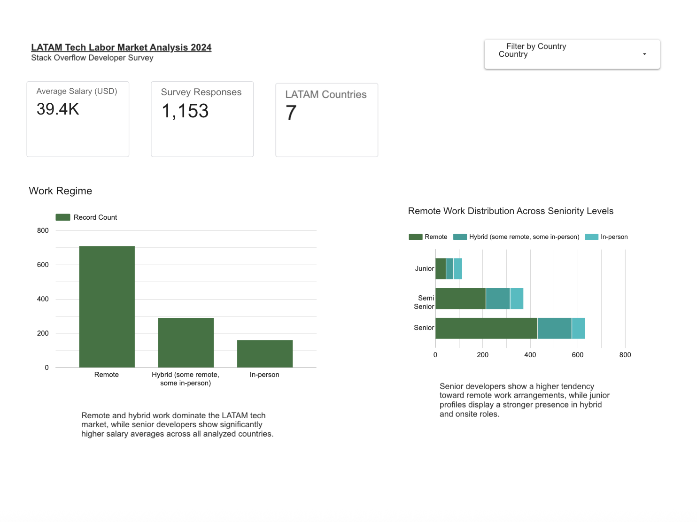

# LATAM Tech Labor Market Analysis 2024

Data analysis and interactive dashboard exploring salary trends, remote work adoption, AI usage and technology preferences among developers in Latin America.

---

## Project Overview

This project analyzes data from the Stack Overflow Developer Survey 2024 to identify key labor market trends across LATAM countries.

The analysis focuses on:

- Salary distribution across countries
- Salary differences by seniority
- Remote work adoption
- AI tool usage
- Most used technologies
- Workforce trends in the regional tech ecosystem

---

## Tools & Technologies

- Python
- Pandas
- NumPy
- Matplotlib
- Google Colab
- Looker Studio
- GitHub

---

## Dataset

Source:
Stack Overflow Developer Survey 2024

https://survey.stackoverflow.co/2024/

---

## Key Insights

- Senior developers earn significantly higher salaries across LATAM markets.
- Remote and hybrid work models dominate the regional tech ecosystem.
- JavaScript, Python and SQL remain the most widely used technologies.
- AI tool adoption shows strong penetration among experienced developers.

---

## Interactive Dashboard

[View Dashboard Here](https://datastudio.google.com/reporting/edb97cbc-affb-474e-a0f2-77ff2e6f34ad)

---

## Dashboard Preview

### Technology & AI Trends


---

### Compensation & Experience Analysis


---

## Project Structure

```bash
latam-tech-labor-market-analysis/
│
├── data/
├── notebooks/
├── images/
├── README.md
└── requirements.txt
```

---

## Author

Eugenio Vivani

LinkedIn:
https://www.linkedin.com/in/eugenio-vivani/

GitHub:
https://github.com/vivanieugenio-hub
