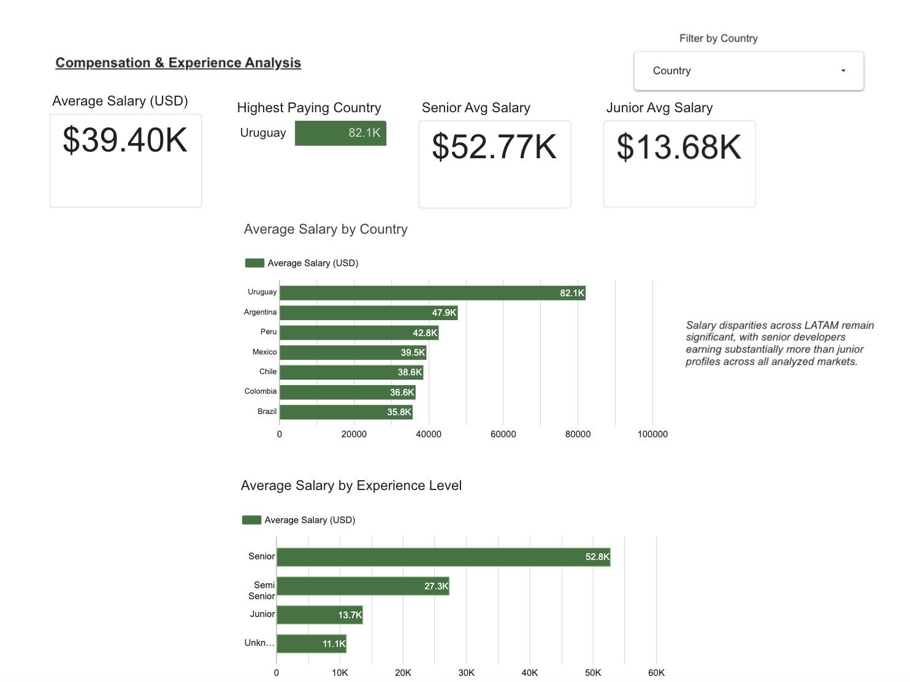
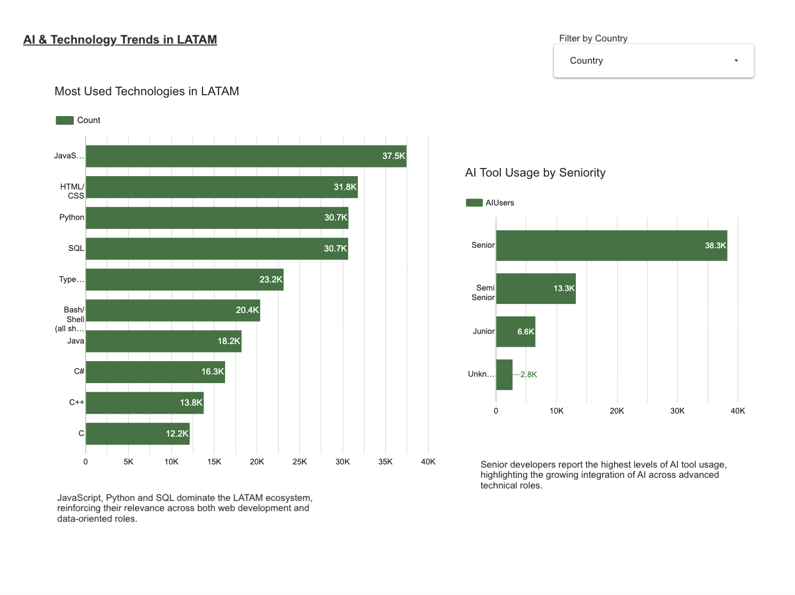

# 🌎 LATAM Tech Labor Market Analysis 2024


Exploratory data analysis and interactive dashboard exploring **salary trends, remote work adoption, AI tool usage, and technology preferences** among developers across Latin America — based on the Stack Overflow Developer Survey 2024.

---

## 🎯 Objective

Map the current state of the tech labor market in LATAM, identifying salary benchmarks by country and seniority, remote work adoption patterns, and the pace of AI integration among developers — providing actionable insights for professionals and hiring teams operating in the region.

---

## 📊 Interactive Dashboard

👉 [**View Live Dashboard on Looker Studio**](https://datastudio.google.com/reporting/edb97cbc-affb-474e-a0f2-77ff2e6f34ad)

### Dashboard Preview






---

## 🔍 Analyses Performed

| # | Analysis | Focus |
|---|----------|-------|
| 1 | Salary distribution by country | Argentina, Brazil, Mexico, Colombia, Chile |
| 2 | Salary by seniority level | Junior → Senior differential |
| 3 | Remote & hybrid work adoption | Regional penetration rates |
| 4 | AI tool usage | By experience level and country |
| 5 | Most-used technologies | Languages, frameworks, databases |
| 6 | Workforce trends | Regional tech ecosystem overview |

---

## 💡 Key Insights

- **Senior developers earn significantly more** across all LATAM markets — the seniority salary premium is the strongest predictor of compensation in the region, outweighing country of residence for high-experience profiles.
- **Remote and hybrid work dominate** the LATAM tech ecosystem, with the majority of developers working fully or partially remote — a structural shift accelerated post-2020 and now consolidated as the norm.
- **JavaScript, Python, and SQL** remain the three most widely used technologies across the region, consistent across all seniority levels.
- **AI tool adoption is concentrated among experienced developers** — senior profiles show significantly higher AI tool usage, suggesting adoption is currently skills-gated rather than equally distributed across the workforce.

---

## 🛠️ Tools & Stack

- **Python** — Pandas, NumPy, Matplotlib
- **Google Colab** — interactive notebook environment
- **Looker Studio** — interactive dashboard and data visualization
- **GitHub** — version control and portfolio presentation
- **Data source:** [Stack Overflow Developer Survey 2024](https://survey.stackoverflow.co/2024/)

---

## 🚀 How to Run

```bash
# Clone the repository
git clone https://github.com/vivanieugenio-hub/latam-tech-labor-market-analysis.git
cd latam-tech-labor-market-analysis

# Install dependencies
pip install -r requirements.txt
```

1. Download the [Stack Overflow Developer Survey 2024](https://survey.stackoverflow.co/2024/) dataset
2. Open `tech_market_analysis.ipynb` in Google Colab or Jupyter
3. Update the data file path in the first notebook cell
4. Run all cells

---

## 📁 Project Structure

```
latam-tech-labor-market-analysis/
│
├── tech_market_analysis.ipynb   # Main analysis notebook
├── requirements.txt             # Python dependencies
├── dashboard_overview.png       # Dashboard screenshot — market overview
├── salary_analysis.png          # Dashboard screenshot — salary & experience
├── ai_trends.png                # Dashboard screenshot — AI & technology trends
└── README.md
```

---

## 🔗 Related Projects

- [Argentine Labor Market Analysis — EPH](https://github.com/vivanieugenio-hub/EPH-mercado-laboral-argentina) — deep-dive into Argentine employment, informality, and wage gaps using official INDEC microdata.
- [Argentine Inflation Analysis — CPI](https://github.com/vivanieugenio-hub/IPC-inflacion-argentina) — CPI evolution across three political periods in Argentina.

---

## 👤 Author

**Eugenio Vivani** — Political Science & International Relations | Junior Data Analyst

[](https://www.linkedin.com/in/eugenio-vivani)
[](https://github.com/vivanieugenio-hub)
